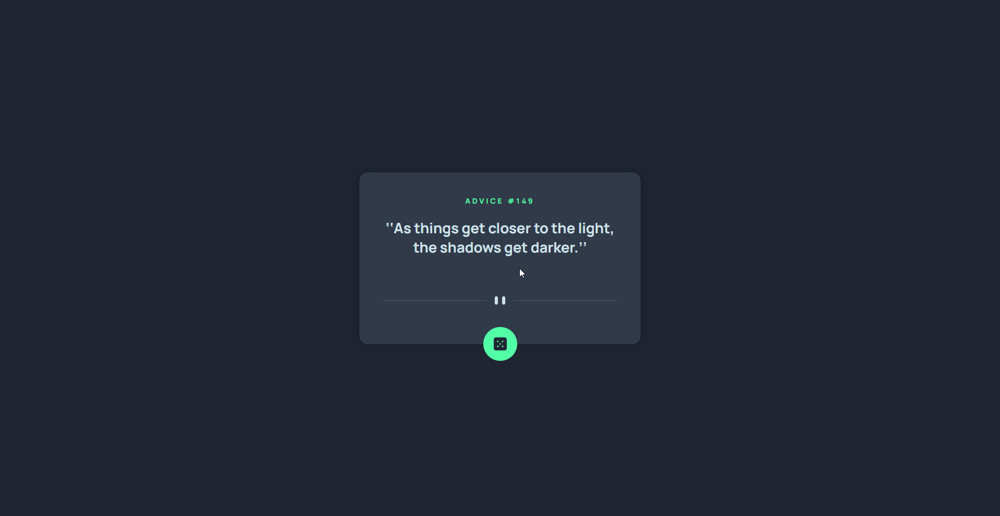

# 🎲 Advice Generator App

Projeto de aplicativo de **Geração de Conselhos Aleatórios**, desenvolvido como desafio do [Front End Mentor](https://www.frontendmentor.io/challenges/advice-generator-app-QdUG-13db). O objetivo foi criar um cartão interativo que exibe frases de conselhos, consumindo uma API externa, com foco em layout limpo, responsividade e interatividade.

---

## 📌 Desafio

Construir um aplicativo funcional contendo:

- Card centralizado exibindo o conselho gerado;
- Número do conselho exibido dinamicamente;
- Botão com ícone para gerar novos conselhos;
- Consumo da API [Advice Slip JSON API](https://api.adviceslip.com/);
- Layout responsivo para diferentes tamanhos de tela;

---

## ⚙️ Funcionalidades

- Geração de conselhos aleatórios via API externa;
- Atualização dinâmica do número e texto do conselho;
- Layout responsivo para desktop e mobile;
- Animação suave e feedback visual ao clicar no botão;

---

## 🛠️ Tecnologias Utilizadas

- **HTML5**
- **CSS3**
- **JavaScript (DOM Manipulation & Fetch API)**

---

## 🖼️ Resultados

---

## 🔗 Veja no GitHub Pages

🔗 [Clique aqui para visualizar o projeto](https://inocenciooo.github.io/advice-generator-app/)
